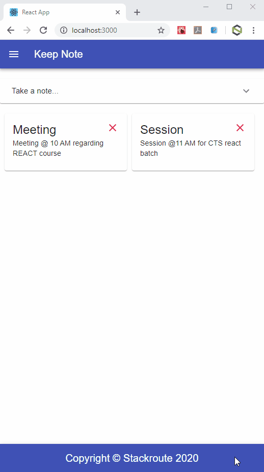

## REACT-REDUX Assignment 4 - KeepNote

### Objective:
The objective of this application is to understand the fundamentals for `REDUX` with `REACT`

## Expected Outcome:
By the end of the assignment you should be able to understand

- REDUX
- REACT REDUX Link
- Action
- Store
- Reducer

## Create a REACT application similar to Google Keep with the following specs:
- `KeepNote` should use MaterialUI for designing the application.
- It should be able to create, read & delete the notes using REDUX.
- It should be able to load all notes on the load of the page as Cards.
- It should have an appbar on the top of the page with title `KeepNote`.

## Instructions:
- Your application should have the below mentioned components.
    - App
    - Header
    - Footer
    - Dashboard
    - AddNote
    - Note
- `App` should be the root component. All components should be rendered inside app component.
- `Header` component should have the app bar.
- `Footer` component should have the copyright information.
- `Dashboard` should be used as a container for Note component. All note Cards should be displayed inside Dashboard component.
- `AddNote` component should be used to accept the values from the user and add a note to state.
    - To have a MaterialUI Expension Panel with title `Take a note...`
    - Expansion Panel to include an `input` Form Control with for taking `Title` for the note.
    - Expansion Panel to include an `input` Form Control with for taking `Description` for the note.
    - Expansion Panel to include a button with text `Add Note` to add and persist the note in the state.
- `Note` component should have the delete button on the top right side of the Card to delete the note.
- Your application should use `REDUX` for managing the state with 3 main building blocks of REDUX - `Store`, `Action`, `Reducer`.

## Finally your application UI should behave & look like below mentioned

## Submitting Solution
- Once the solution is ready push the code to git following the below steps :
    - Create new project on git with the name REACT-Redux-solution
    - On local machine in the folder where your solution code resides, run the command `git init` to initailize new git repo 
    - To add origin run the command `git remote add origin <project-repo-url>`
    - To Stage files for commit, run the command `git add .`
    - To commit files, run the command `git commit -m <commit-msg>`
    - Finally to push the code, run the command `git push -u origin master`
- Assign your Mentor as the Reporter for this git repo and notify him/her for the evaluation
